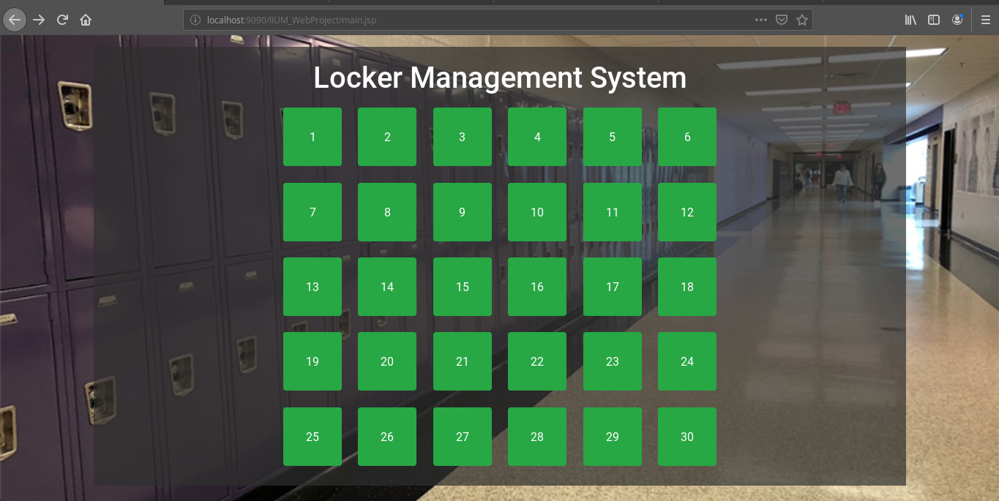
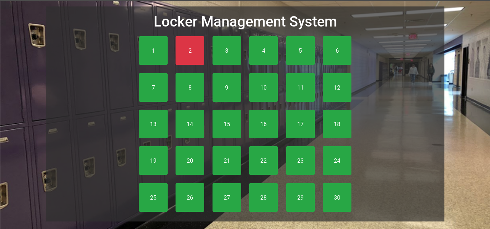
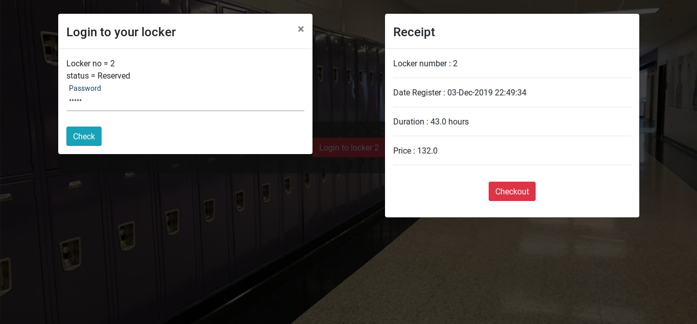

*Locker Management System*
 
**By Al-Latif group**
 

***Overview  :***  
	This web application enables the user to define their custom password for each available locker. The charge of this locker increases gradually within a period of time given. 

***Flow of the System:***
  

 

:pushpin: ***Division Of Tasks*** :  
 
	**Azhad Saifuddin** 		->
	 
	- Define all array in insertPass
	- Display the receipt

	**Adhim Muhammad Ilham**	->
	 
		-Login and registration process for locker
		- Accept values from main page
	  
	**Ikmal bin Ishak**			->  
	 
		-Display the interface of the locker
		-Charge calculation process 
		
	**Yudha Arga Diaz Prawira** ->
	  
		-Get the index and use it to manipulate the locker
		- Update the locker after login and register

References : 
	-Hands-out 
	-https://www.markdownguide.org/basic-syntax/
	-https://getbootstrap.com/docs/4.0/components/modal/
	
	

